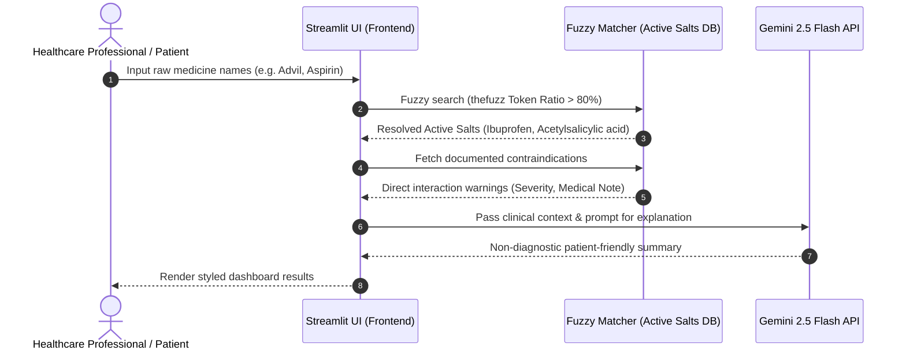

# 🏥 MedSafe AI — Intelligent Healthcare Assistant

An AI-driven clinical decision-support and patient-safety application designed to verify drug-to-drug interactions, extract prescriptions using vision LLMs, and triage symptoms.

> [!NOTE]
> **AI Architecture & Orchestration Demonstration**: This repository serves as a portfolio piece showing how deterministic medical data can be structured alongside non-deterministic large language models (LLMs) to construct highly visual, low-friction healthcare tools. Developed with advanced agentic orchestration using **Gemini 2.5 Flash**.

---

## 🛠 System Architecture & Flow

The system integrates a local fuzzy-matching dataset (active salts & interaction matrix) with the **Gemini 2.5 Flash** model to provide real-time educational guidance.



---

## 🚀 Key Functional Capabilities

*   **Deterministic Safety Layer**: Cross-checks user inputs against a localized clinical mapping database (`data/medicine_db.json`) utilizing **Fuzzy string matching** (`thefuzz`) targeting brand names and active salts.
*   **AI OCR Vision Parser**: Parses handwritten or printed prescription documents to automatically extract medicine brand names and candidate active chemical groups.
*   **Structured Clinical Triage**: Triages post-medication symptoms by executing few-shot structured prompting to classify emergency severity scores (`Low`, `Medium`, `High`) while formatting patient-friendly guidelines.

---

## 📦 Tech Stack & Orchestration

*   **AI Engine**: Google Gemini API (`gemini-2.5-flash` for multi-modal OCR and text summarization).
*   **UI Framework**: Streamlit (configured with customized viewport layout rules mimicking mobile app patterns).
*   **Algorithms**: Fuzzy String Matching (`token_sort_ratio`) for resilient search handling of typos and alternative brands.

---

## 🏁 Getting Started & Local Setup

### Prerequisites
*   Python 3.10+
*   A Google AI Studio API Key (for Gemini access)

### Setup Instructions

1. **Clone the repository**:
   ```bash
   git clone https://github.com/Tusharsharma420/MedSafe-AI---AI-driven-medical-safety-assistant.git
   cd MedSafe-AI---AI-driven-medical-safety-assistant
   ```

2. **Configure environment variables**:
   Create a `.env` file in the root directory:
   ```env
   GEMINI_API_KEY=your_gemini_api_key_here
   ```

3. **Install dependencies**:
   ```bash
   pip install -r requirements.txt
   ```

4. **Launch the local dashboard**:
   ```bash
   streamlit run app.py
   ```

---

## 🌐 Deploying to Streamlit Community Cloud (Free Hosting)

This project is configured to run instantly on Streamlit Community Cloud:

1. Push your updated code changes to GitHub.
2. Visit [share.streamlit.io](https://share.streamlit.io/) and log in with your GitHub account.
3. Select your repository, branch (`main`), and entrypoint file (`app.py`).
4. Click **Advanced Settings** and insert your Gemini token under the secrets section:
   ```toml
   GEMINI_API_KEY = "your_actual_api_key"
   ```
5. Click **Deploy**. Your app will be live with a shareable URL in minutes.
