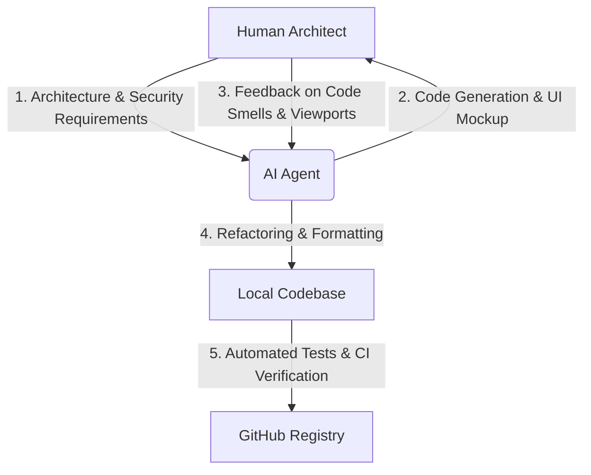

# 🧠 Agentic Engineering: Co-Creating MedSafe AI with Google Gemini

This document provides a technical walkthrough of how **MedSafe AI** was designed, programmed, debugged, and configured through a collaborative partnership between a Human Architect and AI coding agents (using Google Gemini and other advanced developer tools).

---

## 🏛️ 1. Architecture Design Philosophy

When building a medical assistant app, safety is the primary requirement. From a systems perspective, we established a **hybrid deterministic-probabilistic boundary**:

1.  **Deterministic Layer (Local Database)**: All brand name matching, active salt resolutions, and direct contraindications are handled by a structured, offline JSON database (`data/medicine_db.json`). This ensures that known dangerous interactions (such as Aspirin + Warfarin) will **always** trigger a flag without relying on the non-deterministic output of a language model.
2.  **Probabilistic Layer (Gemini LLM)**: The LLM is used exclusively where natural language synthesis, extraction, or soft triaging is required:
    *   *Interaction Summarization*: Translating technical contraindication jargon into simple, patient-friendly instructions.
    *   *Prescription OCR*: Parsing unstructured handwriting or print from images to extract text.
    *   *Symptom Triaging*: Analyzing descriptions of patient discomfort to map emergency risk.

---

## ⚙️ 2. AI Orchestration & Prompt Engineering

The integration with Gemini is optimized in `utils/llm_helper.py` and `utils/ocr_helper.py`. We designed specific prompt specifications:

### A. Non-Diagnostic Patient Summarizer
For summarizing drug interactions:
*   **Role Setup**: Configure the model specifically as `MedSafe AI`, an educational and non-diagnostic assistant.
*   **Boundary Enforcement**: Enforce a strict length limit (3-4 sentences) to prevent rambling or hallucinated advice.
*   **Compulsory Disclaimers**: Force the prompt to end with a clear statement advising the user to consult a doctor.

### B. Structural OCR Extraction (Vision API)
For reading handwritten or printed prescriptions:
*   **Output Constraint**: Enforce that the model return **only** a valid JSON array of objects (containing `name` and `active_salt` keys).
*   **Failsafe Parsing**: Clean up any potential markdown decorators (like ` ```json ` blocks) programmatically in `ocr_helper.py` before executing `json.loads`.

### C. Triaging and Symptom Safety Score
For triage analysis:
*   **Structured Output Format**: Enforce a split response using tags (`RISK_LEVEL:` and `GUIDANCE:`).
*   **Parser Logic**: Python parses this output structure to dynamically render color-coded high/medium/low severity banners in the UI.

---

## 🔧 3. Iterative Debugging & Refactoring History

Throughout development, the Human Architect guided the agents through several rounds of refactoring and quality audits:

### Round 1: Mobile-First Custom CSS Injection
Streamlit defaults to wide, desktop-centric layouts. The agents were instructed to inject a custom `<style>` block into `app.py` to:
*   Constrain the viewport container to a maximum of `480px` to mimic native iOS/Android layout structures.
*   Inject modern fonts (Inter, SF Pro) and apply HSL-tailored card background colors (e.g. Robinhood-style green, medical blue).

### Round 2: Python Code Style & Quality Auditing
*   **Ruff Linter Enforcement**: Cleaned up code smells, including deprecations and bare `except:` blocks (refactored to `except Exception:` to maintain robust error handling during API failures).
*   **Configuration Modernization**: Grouped configurations into a clean `pyproject.toml` layout, separating build requirements, project dependencies, and linter settings.

### Round 3: Testing & Mock Isolation
*   *The Bug*: Initial test suites executed real API calls to Gemini because the `GenerativeModel` was instantiated at the module level during import.
*   *The Fix*: Refactored `tests/test_llm_helper.py` to patch `utils.llm_helper.generation_model` directly, isolating the unit tests from external API dependencies and allowing tests to run offline in CI pipelines.

---

## 🤝 4. Collaborative Development Model



This project demonstrates that using LLMs does not mean sacrificing code quality. By establishing proper testing frameworks, configurations, linters, and architectural boundaries, the Developer controls the system, while the AI accelerates the execution speed.
